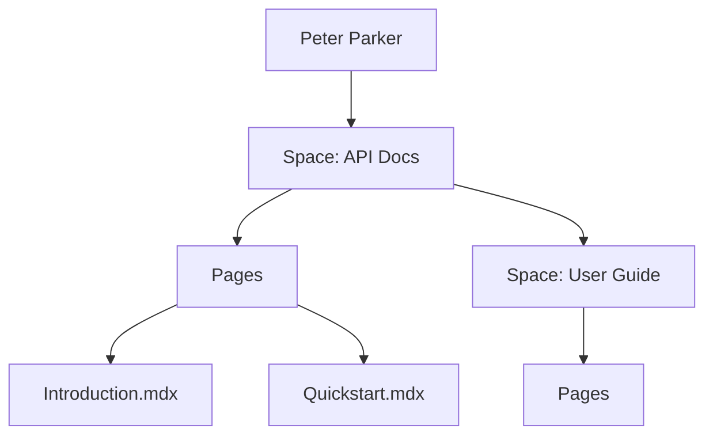

## Overview

Peter Parker organizes your project documentation into flexible spaces. You create spaces to group related docs, add pages within them, and link everything seamlessly. This system supports metadata for searchability and user roles for collaboration. Master these concepts to build scalable documentation.

<Callout kind="info">
  Start with a space for each major project or product to keep your docs organized.
</Callout>

## Core Concepts

Peter Parker's foundation rests on four pillars. Use the grid below to explore them quickly.

<Columns cols={2}>
  <Card title="Spaces" icon="folder" href="#documentation-spaces">
    Group pages into logical containers like projects or teams.
  </Card>
  <Card title="Pages & Linking" icon="link" href="#pages-sections-linking">
    Create hierarchical pages with internal and external links.
  </Card>
  <Card title="Metadata & Tags" icon="tag" href="#metadata-tags">
    Add searchable attributes to pages and sections.
  </Card>
  <Card title="Roles & Permissions" icon="users" href="#roles-permissions">
    Control access with granular user roles.
  </Card>
</Columns>

## Documentation Spaces and Structure

Spaces act as top-level containers. You create a space for each documentation project, such as "API Docs" or "User Guide". Inside, organize pages into folders and sections.



<Expandable title="Advanced Space Features" default-open="false">
  Spaces support custom domains, version history, and integrations with GitHub.
</Expandable>

## Pages, Sections, and Linking

Pages use MDX format with frontmatter for metadata. Sections create hierarchies with H2, H3 headings. Link pages using relative paths.

<Steps>
  <Step title="Create a Page" icon="file-plus">
    Add a new `.mdx` file in your space folder.
  </Step>
  <Step title="Add Frontmatter" icon="settings">
    Include YAML at the top for title and description.
  </Step>
  <Step title="Link Sections" icon="link">
    Use `[Text](/path#section)` for internal navigation.
  </Step>
</Steps>

<CodeGroup tabs="Frontmatter,Linking">
  ```yaml
  ---
  title: Quickstart
  description: Get started fast.
  tags: ["guide", "beginner"]
  ---
  ```
  ```markdown
  ## Overview {#overview}

  [Jump to Setup](#setup)

  ### Setup {#setup}
  Install via npm.
  ```
</CodeGroup>

## Metadata, Tags, and Categorization

Attach metadata via YAML frontmatter. Tags enable filtering and search. Categorize pages for better navigation.

| Property    | Type     | Purpose                  |
|-------------|----------|--------------------------|
| `title`     | string   | Page display name        |
| `tags`      | array    | Search and filter labels |
| `sidebar`   | boolean  | Show in navigation       |

<Tabs>
  <Tab title="Basic Tags" icon="tag">
    Use simple strings like `guide`, `api`.
  </Tab>
  <Tab title="Advanced Metadata" icon="settings">
    ```yaml
    ---
    title: API Reference
    tags: ["api", "reference"]
    version: "v2.1.0"
    ---
    ```
  </Tab>
</Tabs>

## User Roles and Permissions

Assign roles to control access. Admins manage spaces, while viewers read only.

<Callout kind="tip">
  Use the least privilege principle: assign viewer by default, elevate as needed.
</Callout>

| Role       | Permissions                     |
|------------|---------------------------------|
| Admin      | Full CRUD on spaces and pages   |
| Editor     | Edit pages, manage tags         |
| Viewer     | Read-only access                |

<ExpandableGroup>
  <Expandable title="Custom Roles" default-open="true">
    Create roles with granular permissions like "edit metadata only".
  </Expandable>
  <Expandable title="Invite Workflow">
    Send invites via email with role selection.
  </Expandable>
</ExpandableGroup>

## Best Practices

Combine spaces for multi-product docs. Tag consistently for global search. Review permissions regularly to maintain security. These practices ensure your documentation scales with your project.