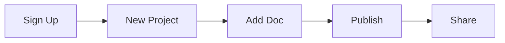

## Prerequisites

Before you begin, ensure you have:

- A modern web browser like Chrome, Firefox, or Safari
- An email address for account verification
- Optional: A GitHub account for version control integration

<Callout kind="info">

Peter Parker supports all major browsers. For the best experience, use the latest version.

</Callout>

## Create Your Account

Sign up in under a minute.

<Steps>
  <Step title="Visit the Dashboard" icon="monitor">
    Navigate to `https://dashboard.peterparker.com/signup`.
  </Step>
  <Step title="Enter Your Details" icon="user">
    Provide your email, name, and a strong password. Click **Create Account**.
  </Step>
  <Step title="Verify Email" icon="mail">
    Check your inbox for the verification link and click it to activate your account.
  </Step>
</Steps>

## Set Up Your First Project

Once logged in, create a documentation space.

<Steps>
  <Step title="New Project" icon="plus">
    Click the **New Project** button in the top-right corner.
  </Step>
  <Step title="Configure Basics" icon="settings">
    Enter a project name like `My Docs` and select a template (e.g., "Blank Space").
  </Step>
  <Step title="Save and Open" icon="save">
    Click **Create**. Your project dashboard opens automatically.
  </Step>
</Steps>

## Navigate the Interface

Peter Parker provides an intuitive interface. Use these key areas:

<Tabs>
  <Tab title="Dashboard" icon="layout">
    Overview of your projects, recent docs, and quick actions.
  </Tab>
  <Tab title="Editor" icon="edit-3">
    Real-time MDX editor with live preview and syntax highlighting.
  </Tab>
  <Tab title="Files" icon="file-text">
    Tree view for organizing documents and assets.
  </Tab>
</Tabs>

## Add Your First Document

Create a new MDX file right away.

<Steps>
  <Step title="New Document" icon="file-plus">
    In your project, click **New Document** and name it `introduction.mdx`.
  </Step>
  <Step title="Add Content" icon="pen-tool">
    Paste this starter template:
    
    <CodeGroup tabs="MDX">
    ````mdx
    ---
    title: Introduction
    description: Welcome to your docs.
    ---
    
    ## Hello World
    
    This is your first document!
    ````
    </CodeGroup>
  </Step>
  <Step title="Preview and Publish" icon="eye">
    Switch to Preview mode. Click **Publish** to make it live.
  </Step>
</Steps>

<Callout kind="tip">

Use the built-in AI assistant (Ctrl+K) to generate more content quickly.

</Callout>

## Next Steps

Explore more features:

<Columns cols={3}>
  <Card title="Customization" icon="palette" href="/configuration">
    Theme your docs with brand colors like `#3B82F6`.
  </Card>
  <Card title="Collaboration" icon="users" href="/authentication">
    Invite team members and manage access.
  </Card>
  <Card title="Advanced MDX" icon="code" href="/introduction">
    Learn components and layouts.
  </Card>
</Columns>



Your first docs space is ready! Dive into [customization](/configuration) next.